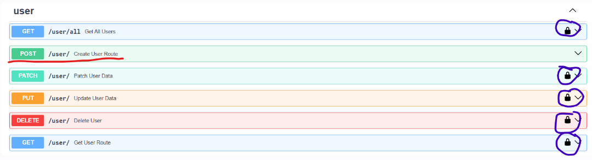

# API_for_library

## Обзорчик

Чтоб запустить приложение нужно:

1) Создать в папке ```/app``` директорию ```/certifications```, перейти туда и выполнить эти
   команды: ```openssl genpkey -algorithm RSA -out jwt-private.key```
   далее ```openssl rsa -pubout -in jwt-private.key -out jwt-public.key``` это нужно для корректной работы jwt сервиса
2) Создать в корне проекта файл ```.env```, скопировать туда файл ```example.env``` заменив в нем пропуски в базе данных
   на корректные
3) Запускаем ```main.py```и приложение работает)

## Дополнение

Хотелось бы тут рассказать, как пользоваться сервисом в swagger ui

Сначала нужно создать пользователя в приложении ```user``` (отмечено красным)
, чтоб попробовать все функции введите роль `admin`, если же хотите попробовать жизнь обычного ридера, введите `reader`

в принципе это единственная функция, которая доступна незареганным пользователям, потом идем вниз в
приложение ```auth```, вводим свой пароль и почту и получаем токен, далее копируем его, идем наверх к этой прекрасной
кнопочке, нажимаем и вставляем туда свой токен. Дальше мы либо радуемся жизни потому что токен
верный, либо нам недоступны функции, потому что токен не тот

Еще хотелось бы сказать про то, что сначала надо добавить автора, а потом только книгу, а не наоборот, потому что что
это такая за книга без автора :)

## Заключение

Тут я хочу сказать о том, что было сделано и можно ли это как-то улучшить (с моей точки зрения)
В принципе я сделал все, о чем просилось изначально, кроме тестов (на момент написания ридми) и пагинации

Что можно улучшить:

1. **Валидация ошибок**. Сейчас было не очень много времени для этого (да и было немного лень с этим возиться, важно же
   чтоб не упал и все), поэтому почти везде обертка `try - except`, кроме сервиса auth, там все прям хорошо обьяснено,
   фронт будет рад:)
2. **Логирование**. Так как я вообще не знал, как это делать раньше и не видел, как это делается обычно в проде в
   компаниях, сделал так, как это вижу сам. Залогал только важные части по типу регистрации, удаления пользователей,
   чтоб не засорять бд, иначе можно там умереть от количества логов на просмотр книг или авторов
3. **Структура проекта**. Возможно можно как-то сделать лучше и качественнее, но я пока не знаю как, поэтому как смог

Код соответствует PEP8, я прогнал его через black

Думаю, что на этом все, всем спасибо!)